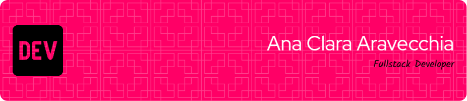

<!-- Top banner -->

  

<h1 align="center">Ana Clara Aravecchia</h1>

Full Stack Developer | Degree in Information Security - FATEC Araraquara  

---

### 🧠 About Me

I'm passionate about technology, cybersecurity, and impactful tech projects.  
Co-founder of the Chapéu de Palha Hacker Club and speaker at events such as Campus Party and Bsides SP.  
Currently working as a developer focused on the .NET stack using C# Javascript and SQL Server.

---

### 🚀 Technologies I can work with:

<table>
  <tr>
    <td align="center"> C</td>
    <td align="center"> <a href="https://developer.mozilla.org/en-US/docs/Web/JavaScript" target="_blank">JavaScript</a></td>
    <td align="center"> Python</td>
    <td align="center"> CSS3</td>
    <td align="center"> HTML5</td>
    <td align="center"> Bootstrap</td>
  </tr>
  <tr>
    <td align="center"> MySQL</td>
    <td align="center"> SQL Server</td>
    <td align="center"> MongoDB</td>
    <td align="center"> C#</td>
    <td align="center"> .NET</td>
    <td align="center"> Bash</td>
  </tr>
  <tr>
    <td align="center"> Git</td>
    <td align="center"> VS Code</td>
    <td align="center"> Visual Studio</td>
    <td align="center"> Raspberry Pi</td>
    <td align="center"> PHP</td>
    <td align="center"> REST API</td>
  </tr>
</table>

---

### 📫 Contact

- ✉️ anaclara.aravecchia@gmail.com  
- 🔗 [GitHub](https://github.com/ClaraAravecchia)  
- 📽️ [Talks on YouTube](https://www.youtube.com/watch?v=mOWF6IPzTlg&t=24670s)
- 💼 [LinkedIn](https://www.linkedin.com/in/ana-clara-aravecchia/)

---

> *“Security is not a product, but a process.” – Bruce Schneier*
